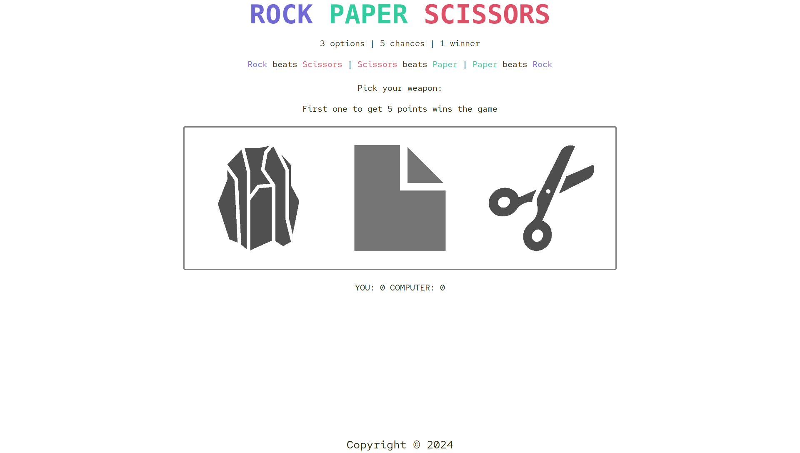

# Rock Paper Scissors Game

A simple Rock Paper Scissors game built with HTML, CSS, and JavaScript, built as part of The Odin Project's Foundations curriculum.

## Description

This project is a basic implementation of the classic Rock Paper Scissors game. The game allows users to play against the computer, with the option to choose from rock, paper, or scissors.

## Features

* Simple and intuitive gameplay
* Responsive design for a smooth user experience
* Basic styling with a modern aesthetic

## Demo

[**Live Demo**](https://kacper-korzen.github.io/rock-paper-scissors/) | [**Project Specs**](https://www.theodinproject.com/lessons/foundations-revisiting-rock-paper-scissors#assignment) 

## Screenshots

## Getting Started

1. Clone the repository to your local machine.
2. Open the `index.html` file in a web browser to play the game.

## License

This project is licensed under the MIT License. See [`LICENSE`](https://choosealicense.com/licenses/mit/)  for details.

## Acknowledgments

- The Odin Project for providing the curriculum and resources
- Flaticon for providing the icon images

## Authors

- [@Kacper K](https://www.github.com/kacper-korzen)
